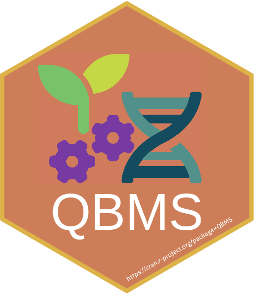

# QBMS 
<!-- badges: start -->
[](https://cran.r-project.org/package=QBMS)
[](https://cran.r-project.org/web/checks/check_results_QBMS.html)
[](https://cran.r-project.org/package=QBMS)
[](https://www.gnu.org/licenses/gpl-3.0.en.html)
[](https://github.com/icarda-git/QBMS/commits/master)
[](https://github.com/icarda-git/QBMS/issues)
[](https://github.com/icarda-git/QBMS)
<!-- badges: end -->

## Overview
Linking data management systems to analytics is an important step in breeding digitalization. Breeders can use this R package to Query the Breeding Management System(s) like [BMS](https://bmspro.io/), [BreedBase](https://breedbase.org), and [GIGWA](https://southgreen.fr/content/gigwa) (using [BrAPI](https://brapi.org/) calls) and help them to retrieve phenotypic and genotypic data directly into their analyzing pipelines developed in R statistical environment.

>___Author and Maintainer:__ [Khaled Al-Shamaa](https://github.com/khaled-alshamaa) <k.el-shamaa (at) cgiar (dot) org>_
>
>___Contributor:__ [Mariano Omar CRIMI](https://github.com/mcrimi) <m.crimi (at) cgiar (dot) org>_
>
>___Contributor:__ Zakaria Kehel <z.kehel (at) cgiar (dot) org>_
>
>___Contributor:__ [Johan Aparicio](https://github.com/apariciojohan) <j.aparicio (at) cgiar (dot) org>_
>
>___Copyright Holder:__ [International Center for Agricultural Research in the Dry Areas (ICARDA)](https://www.icarda.org/)_

## Breeding Management System (BMS)
Breeding Management System ([BMS](https://bmspro.io/)) is an information management system developed by the Integrated Breeding Platform to help breeders manage the breeding process, from programme planning to decision-making. The BMS is customizable for most crop breeding programs, and comes pre-loaded with curated ontology terms for many crops (bean, cassava, chickpea, cowpea, groundnut, maize, rice, sorghum, soybean, wheat, and others). The BMS is available as a cloud application, which can be installed on local or remote servers and accessed by multiple users.

## BreedBase
[Breedbase](https://breedbase.org/) is a comprehensive breeding management and analysis software. It can be used to design field layouts, collect phenotypic information using tablets, support the collection of genotyping samples in a field, store large amounts of high density genotypic information, and provide Genomic Selection related analyses and predictions.

## GIGWA
[GIGWA](https://southgreen.fr/content/gigwa) is a web-based tool which provides an easy and intuitive way to explore large amounts of genotyping data by filtering the latter based not only on variant features, including functional annotations, but also on genotype patterns. The data storage relies on MongoDB, which offers good scalability perspectives. GIGWA can handle multiple databases and may be deployed in either single or multi-user mode. Finally, it provides a wide range of popular export formats.

## BrAPI
The Breeding API ([BrAPI](https://brapi.org/)) project is an effort to enable interoperability among plant breeding databases. BrAPI is a standardized RESTful web service API specification for communicating plant breeding data. This community driven standard is free to be used by anyone interested in plant breeding data management.

## TerraClimate
[TerraClimate](https://www.climatologylab.org/terraclimate.html) is a dataset of monthly climate and climatic water balance for global terrestrial surfaces from 1958-2019. These data provide important inputs for ecological and hydrological studies at global scales that require high spatial resolution and time-varying data. All data have monthly temporal resolution and a ~4-km (1/24th degree) spatial resolution. The data cover the period from 1958-2020. We plan to update these data periodically (annually).

## Installation
```r
install.packages("QBMS")
```

### _Development version_
To get a bug fix or to use a feature from the development version, you can install the development version of QBMS from GitHub.

```r
if (!require("remotes")) install.packages("remotes")
remotes::install_github("icarda-git/QBMS")
```

## Getting Started
Once you successfully install the QBMS R package, you can load it as a library and set up your remote server configuration (e.g., BMS, BreedBase, or GIGWA) by simply copying and pasting the login page URL from your web browser.

```r
# load the QBMS library
library(QBMS)

# config your BMS connection (by providing your BMS login page URL)
set_qbms_config("https://www.bms-uat-test.net/ibpworkbench/controller/auth/login")
```

To start querying and retrieving data from your remote server, you have to login using the same credentials for that server’s GUI/web interface. Please note that you can call the login function(s) with no parameters (interactive mode), where you will get a popup window to insert your username and password (highly advised as one of the best security practices). Although, for automatic analysis pipeline(s) or server services, you can still provide the required username and password as login function parameters (i.e., batch mode).

```r
# login using your account (interactive mode)
login_bms()

# or pass your username and password as parameters (batch mode)
login_bms("username", "password")
```

> _You should be careful when sharing your batch mode code to avoid leaking your credential in public or not authorized spaces._

## Boosting Big Queries Performance
You can get benefit from an external suggested R package (not on CRAN yet) named [async](https://github.com/gaborcsardi/async) to improve the performance of multi-page API calls by optionally enabling asynchronous calls to prevent blocking behavior by fetching all requested pages simultaneously (this helps to reduce the waiting time for the user).

All that you need to do to activate this option is to install the async package manually using the following line of code, and QBMS will take care of the rest ;-)

```r
remotes::install_github("r-lib/async")
```

## Supporting Multiple Provider Connectors
You can switch between an ongoing QBMS connection and another server/database connection by using `get_qbms_connection()` and `set_qbms_connection()` functions, as shown in the following example (i.e., if there is a need to switch forth and back during the same session):

```r
# configure QBMS to connect the phenotypics server
set_qbms_config("https://www.bms-uat-test.net/ibpworkbench/controller/auth/login")

# login and retrieve data from the phenotypic server

# save current connection (phenotypic server)
con1 <- get_qbms_connection()

# configure QBMS to connect the genotypic server
set_qbms_config("https://gigwa.southgreen.fr/gigwa/", engine = "gigwa", no_auth = TRUE)

# retrieve data from the genotypic server

# save current connection (before switch)
con2 <- get_qbms_connection()

# load the saved phenotypic server connection
set_qbms_connection(con1)

# continue retrieving data from the phenotypic server
```

> A detailed example is available in the documentation of the `get_qbms_connection()` and `set_qbms_connection()` functions.

Also, you can find a more elegant solution developed by [Francisco Agosto-Perez](https://ilci.cornell.edu/our-team/francisco-agosto-perez/) from the Breeding Informatics team within the Innovation Lab For Crop Improvement at Cornell University available here: 
[https://github.com/agostof/BrAPI-Provider/](https://github.com/agostof/BrAPI-Provider/)

## Error and Debugging
If you get unexpected results or weird behavior and want to dig deep and investigate what went wrong, you can get a copy of the internal QBMS variables by calling the `debug_qbms()` function.

```r
dump <- debug_qbms()

dump$config
# $crop
# [1] "maize"
# 
# $server
# [1] "https://www.bms-uat-test.net"
# 
# $path
# [1] "bmsapi"
# 
# $page_size
# [1] 1000
# 
# $time_out
# [1] 120
# 
# $base_url
# [1] "https://www.bms-uat-test.net/bmsapi"
# 
# $engine
# [1] "bms"

names(dump$state)
# [1] "token"         "program_db_id" "trial_db_id"   "study_db_id"   "user"         
# [6] "expires_in"    "errors"        ...

dump$state$token
# [1] "username:1666907125029:a312bb036cc8d9cc302bee1f0981e5ab"
```

## Troubleshooting the Installation
1. If the installation of QBMS generates errors saying that some of the existing packages cannot be removed, you can try to quit any R session, and try to start R in administrator (Windows) or SUDO mode (Linux/Ubuntu) then try installing again.

2. If you get an error related to packages built under a current version of R, and updating your packages doesn’t help, you can consider overriding the error with the following code. _Note: This might help you install QBMS but may result in other problems. If possible, it’s best to resolve the errors rather than ignoring them._

```r
Sys.setenv("R_REMOTES_NO_ERRORS_FROM_WARNINGS" = TRUE)

remotes::install_github("icarda-git/QBMS", upgrade = "always")
```

3. If you get an error related to list or set runs in GIGWA (i.e., `gigwa_list_runs()` and `gigwa_set_run()` functions), you can try to ensure that your R session system locale is using UTF-8 character set encoding. You may consider overwriting your system locale with the following command to resolve this issue:

```r
Sys.setlocale("LC_ALL", "English_United States.utf8")
```

4. If you get the following error message, then make sure to [install the suggested `async` package](#boosting-big-queries-performance) to fix it.

```r
Error: 'synchronise' is not an exported object from 'namespace:async'
```

## References
* Peter Selby et al., BrAPI-an application programming interface for plant breeding applications, _Bioinformatics_, Volume 35, Issue 20, 15 October 2019, Pages 4147–4155, [https://doi.org/10.1093/bioinformatics/btz190](https://doi.org/10.1093/bioinformatics/btz190)

* The Breeding API (2022, December 15). BrAPI Compatible Software list. Retrieved from [https://brapi.org/compatibleSoftware](https://brapi.org/compatibleSoftware)

* Excellence in Breeding Toolbox (2023, February 1). Query Breeding Management Systems (QBMS) R package. Retrieved from [https://excellenceinbreeding.org/toolbox/tools/query-breeding-management-systems-qbms-r-package](https://excellenceinbreeding.org/toolbox/tools/query-breeding-management-systems-qbms-r-package)

* CGSpace (2023, February 23). Query Breeding Management Systems (QBMS) R package. Retrieved from [https://cgspace.cgiar.org/handle/10568/128828](https://cgspace.cgiar.org/handle/10568/128828)

* MELSpace (2023, February 23). Query Breeding Management Systems (QBMS) R package. Retrieved from [https://repo.mel.cgiar.org/handle/20.500.11766/68139](https://repo.mel.cgiar.org/handle/20.500.11766/68139)
